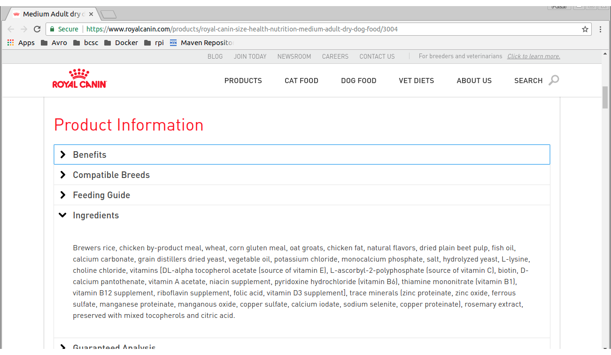
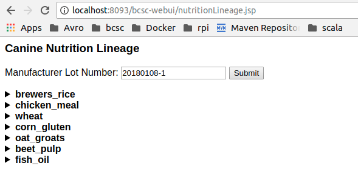
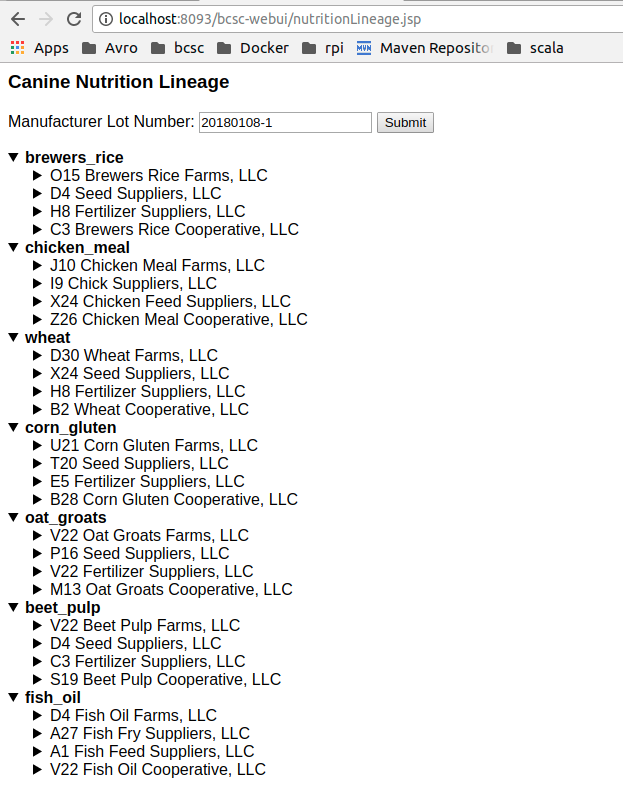
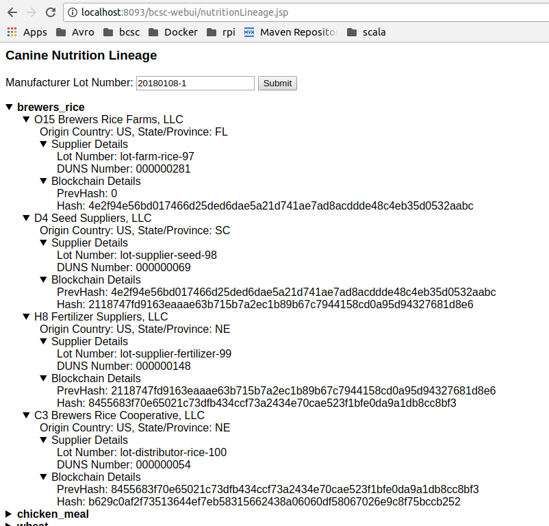
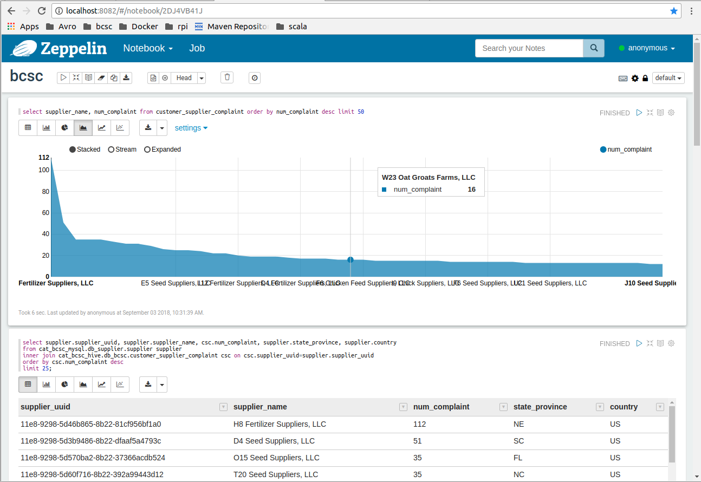
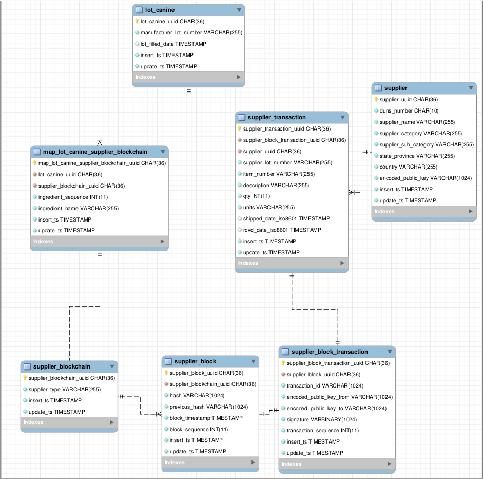

# blockchain-supplychain
## Demonstration implementation of Blockchain and Big Data for Supply Chain

### [Slides](https://github.com/petezybrick/blockchain-supplychain/blob/develop/src/site/markdown/bcsc.pptx)
### Screenshots linked at bottom of this file

## Overall Objectives
- Demonstrate Real World Use Cases for Blockchain in Supply Chain via Pet Nutrition
- Apply Big Data and Relational to Blockchain 
- Learn about Blockchain (but not Bitcoin)
- Complex, Configurable Simulation Generation
- Maximize Developer Efficiency
- Data Science Ready
- Utilize Open Source, Industry Standard Approaches

## Company Objectives
- Let Customers Know Where The Food Is From
- Immutable Tracking Of Ingredient Supply Chains
- Customers Complaining – What Is Root Cause?
- Data Available for Analytics and Data Science
- Maximize Supplier Quality
- Reduce Costs
- Earlier Detection of Potential Issues
- Future Predictive Analytics

## Customer Objectives
- Where Is My Pet Food From?
- My Dog Is Getting Sick – Is It The Food?
- Proactive Notification from the Company

## Screenshots
### Canine Nutrition Example - Note the Ingredients

### Home Page - Lot Number entered

### All Ingredients - Supply Chain

### Single Ingredient - End to End SupplyChain with Blockchain

### Zeppelin - Culprit Query and Graph

### Data Model

